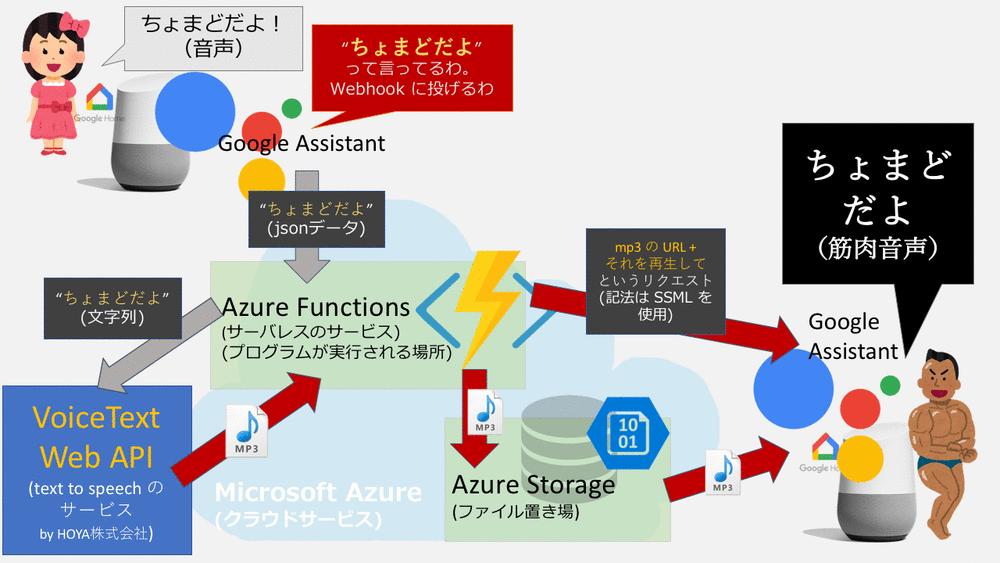

# Chomado Voice

ちょまどさんのような筋肉を感じる声に変えてもらいましょう！    
という Google Home 対応アプリです。C# で書いてます。Node.js 一行も書いてません。


````
ユーザ「OKグーグル、ちょまどボイス」

「はい、ちょまどボイスに繋ぎます」

ユーザ「私の名前はちょまどです」

(めちゃイカツイ声で)「私の名前はちょまどです」
````

# 構成図（アーキテクチャ）

Microsoft のクラウドサービスである「[Microsoft Azure](https://aka.ms/azureevajp)　(アジュール)」などを使ってるよ！

使っているもの：
1. 自然言語解析エンジンの Dialogflow (一応挟んでるけど、今回は発した言葉のオウム返しなので、あんまり処理は書いてない。Webhook に飛ばす綱渡しのために入れてる)
1. [Microsoft Azure](https://aka.ms/azureevajp) の `サーバーレス` のサービスである [Azure Functions](https://azure.microsoft.com/services/functions/?WT.mc_id=dotnet-0000-machiy) (アジュール・ファンクション)。ここで自分の書いたプログラムが動くことになる
1. 文字列を渡したらそれを任意の声で読み上げてくれる `text to speech`のサービス「[VoiceText Web API](https://cloud.voicetext.jp/webapi)」
1. [Microsoft Azure](https://aka.ms/azureevajp) の `ファイル置き場` の [Azure Storage](https://azure.microsoft.com/services/storage/?WT.mc_id=dotnet-0000-machiy) (アジュール・ストレージ)



